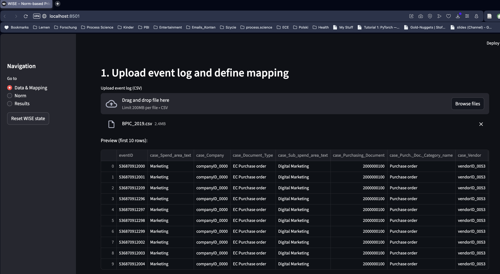
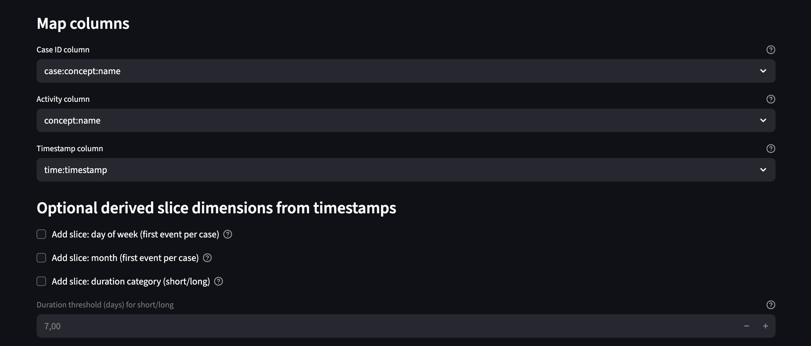
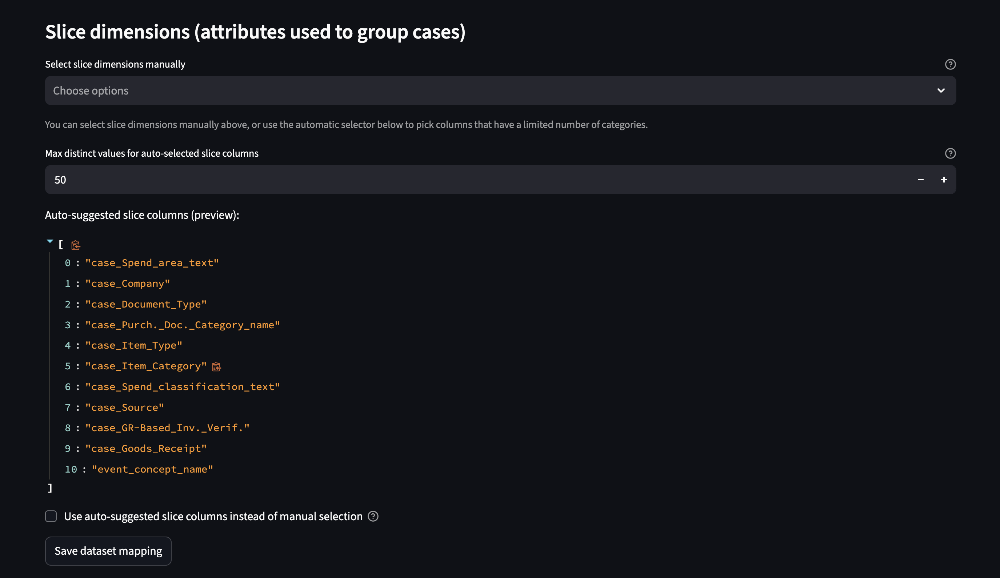
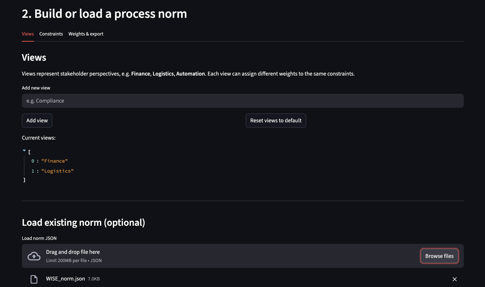
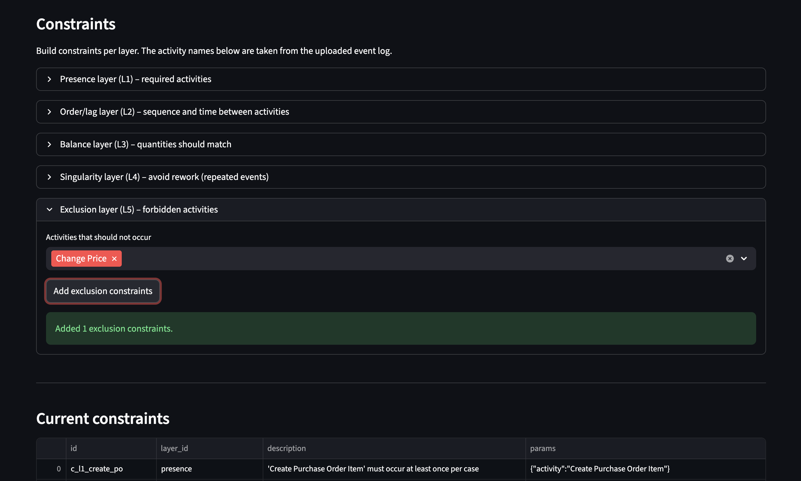
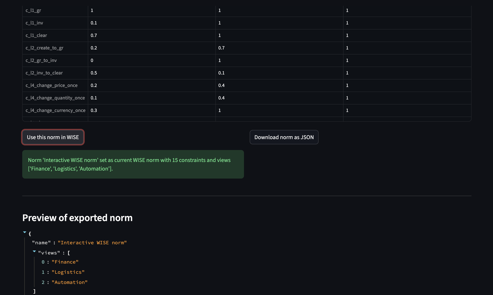
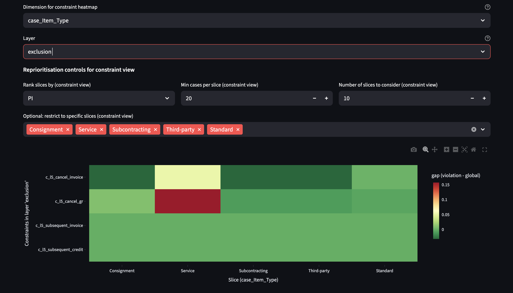
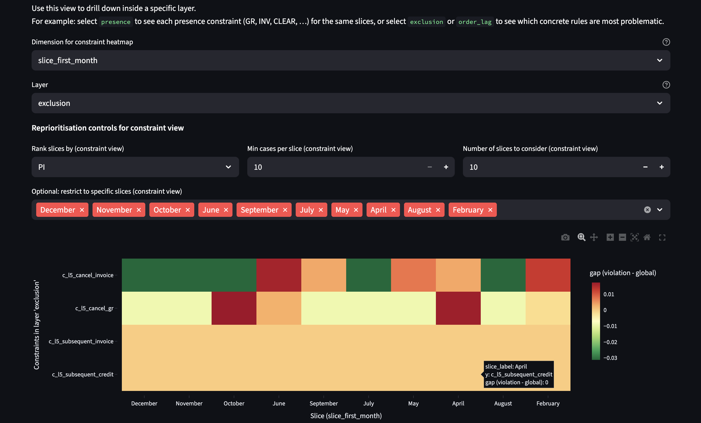
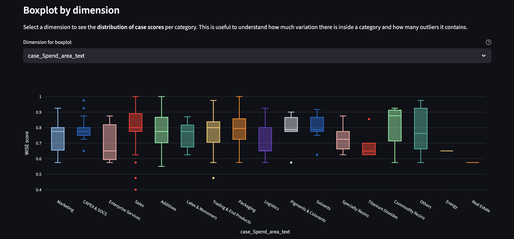

# WISE

**W**eighted **I**nsights for **S**coring **E**fficiency  
(also used as *Weighted Insights for Evaluating Efficiency*)

WISE is a norm-based scoring method and Python library for process mining.  
It encodes business expectations as a set of constraints over event logs,
scores each case against those constraints, and aggregates scores over
business segments (“slices”) to indicate where deviations from the norm
are both frequent and pronounced.

The library is designed to be:

- **Modular** – layers (presence, order, balance, etc.) are pluggable.
- **Tool-agnostic** – works on standard case-centric event logs (CSV → pandas).
- **Explainable** – scores decompose into per-constraint and per-layer contributions.
- **Interactive** – comes with a Streamlit UI to upload logs, build norms,
  run WISE, and explore heatmaps and boxplots.

---

## 1. Method overview (informal)

In many process mining projects, event logs are explored with dashboards,
generic PPIs, and ad-hoc rules. This often yields interesting diagnostics but
does not provide a small, auditable list of **where to act first**.

WISE takes a different route:

1. **Define a process norm**  
   Business goals (e.g. “reliable three-way matching”, “less rework”) are
   translated into a set of constraints grouped into layers such as:

   - *Presence* – mandatory steps should occur.
   - *Order/Lag* – steps should occur in the right order and within a time window.
   - *Balance* – quantities or amounts should “add up” within a tolerance.
   - *Singularity* – certain activities should not repeat.
   - *Exclusion* – forbidden steps or patterns should not occur.

   Each constraint can have different weights per *view* (e.g. Finance vs Logistics).

2. **Score cases against the norm**  
   For each case (trace), WISE computes a bounded violation for each
   constraint and aggregates them into a case-level score per view.

3. **Aggregate by slices and compute a Priority Index (PI)**  
   Cases are grouped into slices (e.g. `company × spend area × matching regime`).
   For each slice, WISE computes:

   - the average case score,
   - the gap to the global mean,
   - and a simple **Priority Index**:  
     `PI = number_of_cases × gap`.

   This helps answer “which segments are furthest from the norm and affect the
   most cases?”.

WISE focuses on **descriptive** prioritisation. It does not estimate causal
effects of interventions; those remain the task of further analysis and
experimentation.

---

## 2. Repository structure (simplified)

The core code is organised as a Python package:

```text
src/
  wise/
    __init__.py
    model.py           # Norm, Constraint, View data structures
    norm.py            # view-weight aggregation and helpers
    layers/            # pluggable layer implementations
      base.py          # BaseLayer interface
      presence.py
      order_lag.py
      balance.py
      singularity.py
      exclusion.py
    io/
      log_loader.py    # event log loading & normalisation
      norm_loader.py   # norm loading (JSON, etc.)
    scoring/
      scoring.py       # case-level scores + per-layer/constraint violations
      slices.py        # slice-level aggregation & PI, slice-layer matrices
      eb.py            # empirical-Bayes shrinkage
      bootstrap.py     # optional confidence intervals
    ui/
      app.py           # Streamlit entrypoint
      state.py         # shared session state helpers
      data_page.py     # upload & mapping UI
      norm_page.py     # interactive norm builder
      results_page.py  # scoring, heatmaps, boxplots

tests/
  conftest.py
  test_presence_layer.py
  test_norm_loader.py
  test_scoring.py

data/
  BPIC_2019.csv        # (optional) example event log – not in repo by default
  WISE_norm.json       # (optional) example norm
  ...                  # optional: outputs (case scores, slice summary, etc.)

pyproject.toml         # build configuration
requirements.txt       # dependencies
README.md
```

---

## 3. Installation

You need **Python 3.10+** and either `conda` or `venv`.  
The examples below use `conda`, but any virtual environment manager works.

### 3.1. Create and activate a virtual environment

```bash
conda create -n wise-env python=3.10
conda activate wise-env
```

### 3.2. Install dependencies and the package

From the repository root:

```bash
pip install -r requirements.txt
pip install -e .
```

The second command installs WISE as an editable package so you can import
`wise` from your own scripts, notebooks, or the Streamlit app.

### 3.3. Run tests (optional but recommended)

```bash
pytest
```

If tests pass, the core library is installed correctly.

---

## 4. Starting the Streamlit UI

The Streamlit app is the easiest way to use WISE:

```bash
conda activate wise-env
streamlit run src/wise/ui/app.py
```

Streamlit will print a local URL, typically:

```text
Local URL: http://localhost:8501
```

Open this in your browser.

### 4.1. Workflow inside the app

The app has three main pages (left sidebar):

1. **Data & Mapping**
   - Upload a CSV event log (e.g. BPIC 2019).
   - Map:
    - Case ID → e.g. `case:concept:name`
      - Activity → e.g. `concept:name`
      - Timestamp → e.g. `time:timestamp`
       - Optionally create **derived slices**:
      - day of week / month of the first event,
      - short/long duration based on a configurable threshold.
       - Choose **slice dimensions** manually or let WISE auto-suggest columns
      with low cardinality (e.g. `case_Company`, `case_Spend_area_text`).
       - Click **"Save dataset mapping"**.

       

       

      
    2. **Norm**
       - **Views tab**: define stakeholder views (Finance, Logistics, …) or load an
      existing norm JSON.

      

       - **Constraints tab**:
     - Use expanders to add constraints per layer:
       - Presence (L1),
       - Order/Lag (L2),
       - Balance (L3, using numeric quantity columns),
       - Singularity (L4),
       - Exclusion (L5).
     - Activity names are suggested from your event log.
     - A “Current constraints” table shows each constraint with a human-readable description.
    

   - **Weights & export tab**:
     - Edit a **constraint × view** weight table. Each weight is a discrete value
       in **0.0–1.0** (steps of 0.1).
     - Click **“Use this norm in WISE”** to feed it into the Results page.
     - Click **“Download norm as JSON”** to save it as `WISE_norm.json`.
    
3. **Results**
   - Choose a **view** (e.g. Finance, Logistics).
   - Optionally tune the **layer sliders** (global what-if):
     - 0 → ignore this layer,
     - 1 → use original view weights,
     - >1 → boost the layer’s importance.
     
   - Choose **shrinkage k** (Empirical-Bayes stabilisation across slices).
   - Click **“Compute scores and priorities”**.
   - Explore:
     - **Slice-level table** with `n_cases`, `mean_score`, `gap`, `PI`.
     - **Top slices by PI** bar chart.
     - **Layer × slice heatmap** (full key or single dimension).
     
     - **Constraint × slice heatmap** within a selected layer.
     
     
     - **Boxplot by dimension** (distribution of case scores per category).
         
     - **Scores heatmap by dimension** (similar to earlier `cat_dim` notebook plots).
     

You can always hit **“Reset WISE state”** in the sidebar to clear all
uploaded data, norms, and results.

---

## 5. Using WISE programmatically

You can also import and use WISE in your own Python code, without the UI.

```python
import pandas as pd
from wise.io.log_loader import load_event_log
from wise.io.norm_loader import load_norm_from_json
from wise.scoring.scoring import compute_case_scores
from wise.scoring.slices import aggregate_slices

# 1. Load event log
df = load_event_log(
    "data/BPIC_2019.csv",
    case_id_col="case:concept:name",
    activity_col="concept:name",
    timestamp_col="time:timestamp",
)

# 2. Load process norm
with open("data/WISE_norm.json", "r", encoding="utf-8") as f:
    norm = load_norm_from_json(f)

view_name = norm.get_view_names()[0]  # e.g. "Finance"

# 3. Case-level scores
case_scores = compute_case_scores(
    df=df,
    norm=norm,
    view_name=view_name,
    case_id_col="case:concept:name",
    activity_col="concept:name",
    timestamp_col="time:timestamp",
)

# 4. Slice-level aggregation
slice_summary = aggregate_slices(
    df_scores=case_scores,
    df_log=df,
    case_id_col="case:concept:name",
    slice_cols=["case_Company", "case_Spend_area_text"],
    shrink_k=50.0,
)

print(slice_summary.head())
```

---

## 6. Defining norms via JSON

Norms can be defined in JSON and loaded via `wise.io.norm_loader`.
The Streamlit builder produces files that follow this schema:

```json
{
  "metadata": {
    "name": "P2P baseline norm"
  },
  "views": ["Finance", "Logistics"],
  "constraints": [
    {
      "id": "c001",
      "layer_id": "presence",
      "params": { "activity": "Record Goods Receipt" },
      "base_weight": 1.0,
      "view_weights": { "Finance": 0.2, "Logistics": 0.3 }
    },
    {
      "id": "c002",
      "layer_id": "order_lag",
      "params": {
        "activity_from": "Record Goods Receipt",
        "activity_to": "Record Invoice Receipt",
        "max_days": 10
      },
      "base_weight": 1.0,
      "view_weights": { "Finance": 0.3, "Logistics": 0.4 }
    }
    // ... more constraints ...
  ]
}
```

Each constraint has:

- `id` – unique identifier.
- `layer_id` – one of the registered layers
  (`presence`, `order_lag`, `balance`, `singularity`, `exclusion`, …).
- `params` – layer-specific configuration.
- `base_weight` – default importance.
- `view_weights` – optional overrides per view.

You can edit these JSON files by hand or use the Streamlit norm builder to
create and export them.

---

## 7. Extending WISE

- **New layers**  
  Add a file in `src/wise/layers/` that subclasses `BaseLayer` and implements
  `compute_violation(trace, constraint, activity_col, timestamp_col)`.  
  Register the layer’s `LAYER_ID` in `wise.layers.__init__` and use it in norms.

- **New views**  
  Add view names to the `views` list in the norm file, and specify
  `view_weights` for constraints as needed.

- **New visuals / analyses**  
  The Streamlit app is modular: you can add pages or sections that reuse
  `case_scores` and slice matrices for your own charts.

---

## 8. Status and caveats

WISE is currently a research/experimental codebase. It has been applied to
BPIC 2019 and a limited set of industrial P2P logs. The example norms and
weights included here should be seen as starting points, not ready-made
standards. For new contexts, norms should be adapted and reviewed with local
domain experts.

Contributions (bug reports, small PRs, or examples) are very welcome.
